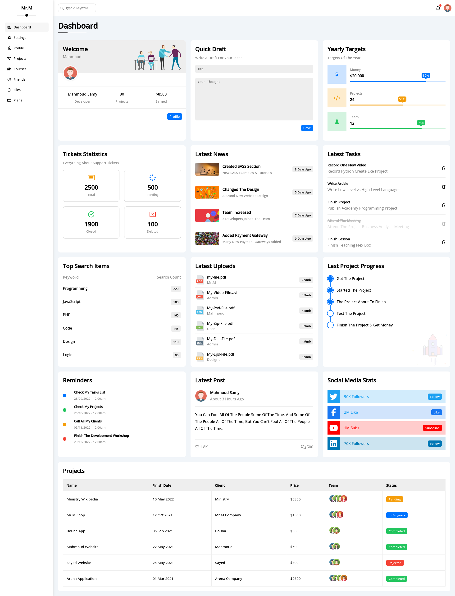
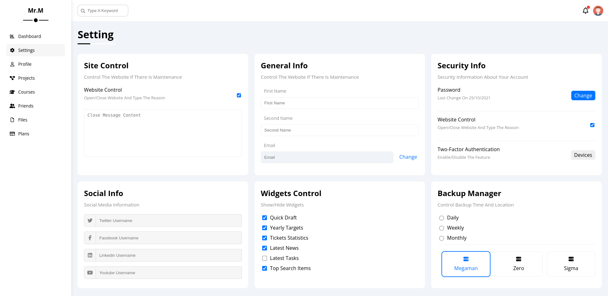
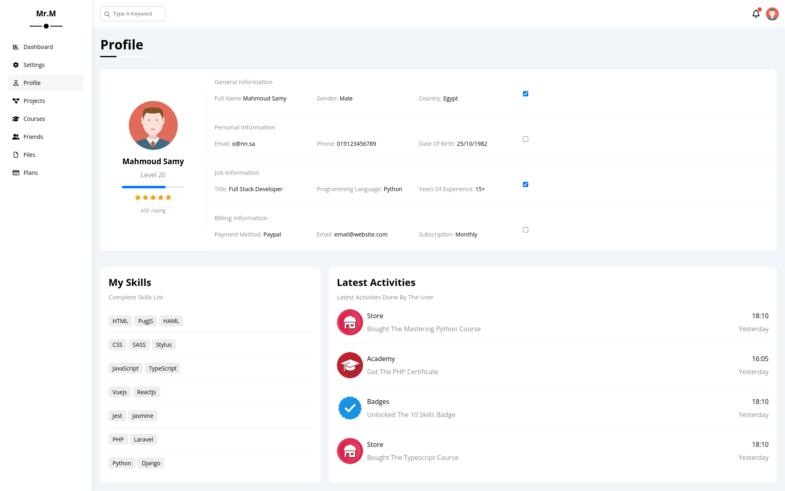
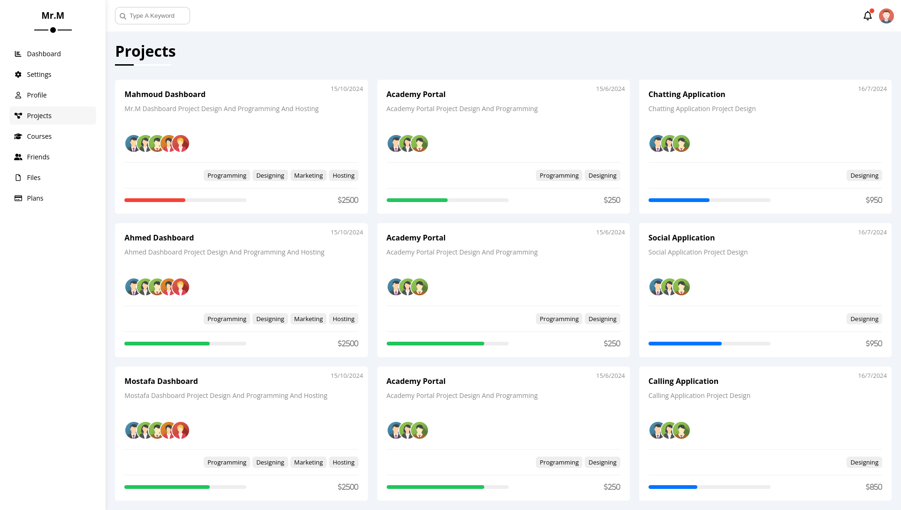
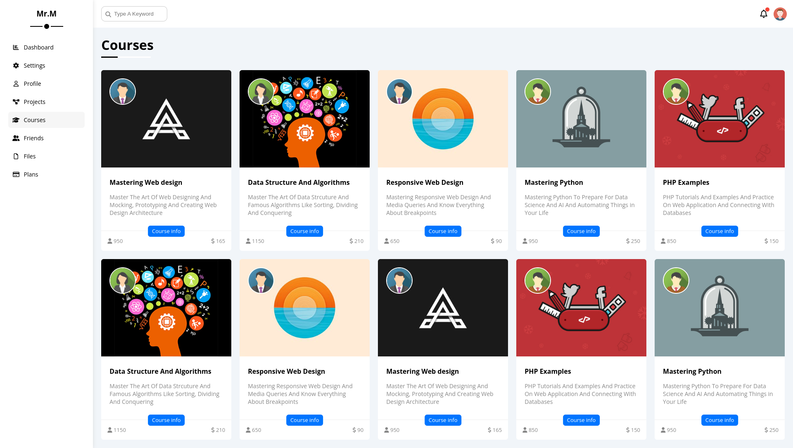
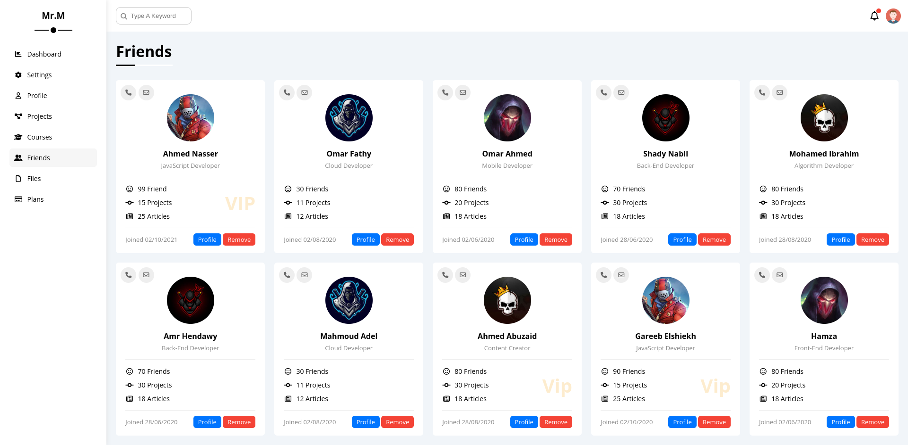
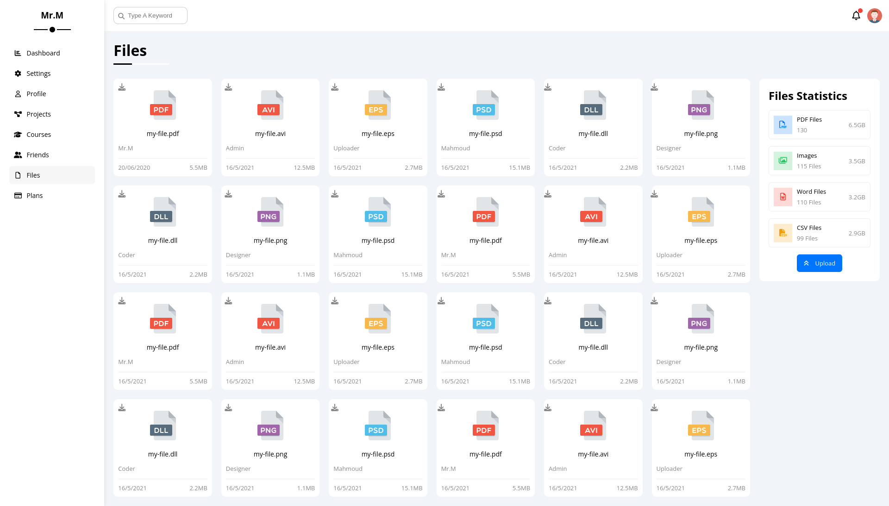
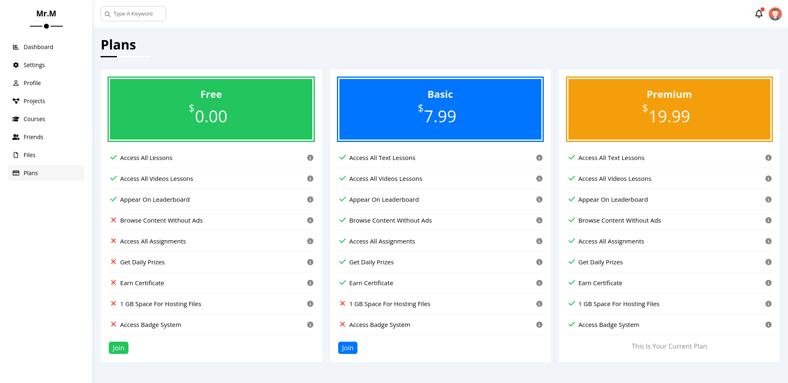

# Full Website with Custom CSS Framework - HTML & CSS  

This project is a **fully responsive and modern website**, developed entirely with **HTML and CSS**. To enhance development efficiency, I created a **custom CSS framework**, making the styling process more flexible and scalable. The website consists of multiple structured pages, each designed with a **clean UI and seamless user experience**.  

---

## 🔹 Project Overview  
- 🎨 **Custom-built CSS framework** for efficiency and scalability  
- 🏗 **Multi-page structure**, covering essential sections  
- 📱 **Fully responsive** for optimal performance on all devices  
- ⚡ **Fast-loading and optimized design** with minimal CSS overhead  
- 🛠 **Well-structured and maintainable code** for easy modifications  

---

## 🔹 Website Pages  
✔ **Dashboard:** The main hub displaying an overview of activities and statistics  
✔ **Settings:** Allows users to customize preferences and manage account configurations  
✔ **Profile:** A user profile page featuring personal details and settings  
✔ **Projects:** A section for tracking and managing projects efficiently  
✔ **Courses:** A structured learning page showcasing available courses  
✔ **Friends:** A social feature displaying a list of connections and interactions  
✔ **Files:** A file management system for organizing and accessing documents  
✔ **Plans:** A pricing and subscription plans section with detailed offers  

---

## 🔹 Technologies Used  
💠 **HTML5** – For structuring the content across all pages  
💠 **Custom CSS Framework** – Designed from scratch for flexibility and efficiency  
💠 **Flexbox & CSS Grid** – For responsive layouts and optimized design  
💠 **Media Queries** – Ensuring full compatibility with different screen sizes  

---

## 🔹 Key Features  
⚡ **Lightweight and fast performance** with optimized CSS  
⚡ **Scalable and reusable framework**, making future developments easier  
⚡ **Fully responsive and mobile-friendly** layout  
⚡ **Modular structure**, ensuring ease of customization and expansion  

This project is a reflection of my ability to **design and develop structured web applications** using **pure HTML and CSS** while optimizing workflow with a **custom-built CSS framework**. If you are looking for a **well-organized, efficient, and scalable front-end solution**, this project is a great example. 🚀  

# Website mockUps

## Dashboard Page

## Settings Page

## Profile Page

## Projects Page

## Courses Page

## Friends Page

## Files Page

## Plans Page

📩 **For more details or a live preview, feel free to reach out!**